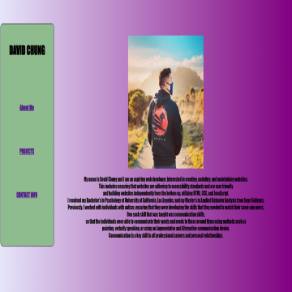

# David-Chung-Portfolio

## Technology Used 

| Technology Used         | Resource URL           | 
| ------------- |:-------------:| 
| HTML    | [https://developer.mozilla.org/en-US/docs/Web/HTML](https://developer.mozilla.org/en-US/docs/Web/HTML) | 
| CSS     | [https://developer.mozilla.org/en-US/docs/Web/CSS](https://developer.mozilla.org/en-US/docs/Web/CSS)      |   
| Git     | [https://git-scm.com/](https://git-scm.com/)     |    

## Description 

[Visit the Deployed Site](https://dchung13.github.io/David-Chung-Portfolio/)

This is a repository for a portfolio website for myself. This website includes a short section with information relevant to myself and my previous education.
It also includes a section pertaining to the projects that I have worked on and will be working on in the future.
Lastly, this website includes a section with links to contact me through LinkedIn or Email, and also links to my GitHub.


Again, here is the link to my website:
[Site Landing Page](https://dchung13.github.io/David-Chung-Portfolio/)


## Table of Contents 

* [Code Example](#code-example)
* [Learning Points](#learning-points)
* [Author Info](#author-info)
* [Credits](#credits)
* [License](#license)


## Code Example


```html
        <aside>
             <nav>
                <h1 class="home">DAVID CHUNG</h1>
                    <section id="buttons-for-sections" class="navigation-bar">
                        <ul>
                            <li>
                                <a href="#About-Me-Description">About Me</a>
                            </li>
                            <li>
                                <a href="#Projects-Description">PROJECTS</a>
                            </li>
                            <li>
                                <a href="#Contact-Info-Description">CONTACT INFO</a>
                            </li>
                        </ul>
                    </section>
             </nav>
        </aside>
```

The above is an example of html used to define a navigation bar that holds all of the links to the different sections in the website.

```css

aside {
    margin-top: 4%;
    text-align: center;
    width: 18%;
    height: 600px;
    position: fixed;
    background-color: var(--pastelg);
    border: 1px solid var(--oomph);
    border-radius: 12px;
    display: flex;
}

h1 {
    font-size:xx-large;
    font-weight:bolder;
    margin-top: 20%;
    margin-bottom: 5%;
    justify-content: center;
}

.navigation-bar {
    display: flex;
    flex-direction: column;
    justify-content: center;
    z-index: 2;
}

.navigation-bar ul {
    color: var(--milk);
}

.navigation-bar ul li {
    justify-content: center;
    font-size: large;
    font-weight: bold;
    margin-top: 60%;
    margin-bottom: 20%;
    list-style: none;
}

```
The above is the related css properties for the navigation bar which denotes the different properties of the elements inside the navigation bar.


```html
 <section id="Projects-Description" class="Description">
                        <section class="row justify-center">
                            <section class="projects-flexbox">
                                <figure id="Horiseon-Landing-Page" class="Project-Card">
                                    <a href="https://dchung13.github.io/Site-Refractoring/">
                                        
                                    </a>
                                    <div class="card-text">
                                        <p>Site refactoring project, where given a source code, edits were made to ensure that the website followed accessibility guidelines.</p>
                                    </div>
                                </figure>

                                <figure id="Portfolio" class="Project-Card">
                                    <a href="https://dchung13.github.io/David-Chung-Portfolio/">
                                        
                                    </a>
                                    <div class="card-text">
                                        <p>Portfolio porject, where the entire source code was written to create a professional portfolio utilizing HTML and CSS.</p>
                                    </div>
                                </figure>

                                <figure id="CSS-Code-Snippet" class="Project-Card">
                                    <a href="https://dchung13.github.io/css-snippet-cheat-sheet/">
                                        
                                    </a>
                                    <div class="card-text">
                                        <p>CSS Code Reminders for advanced CSS functions.</p>
                                    </div>
                                </figure>
                            </section>
                        </section>   
            </section>
```
The above is an example of the html used to identify the projects section of the website, including different figures for each project that I have worked on. This page will be updated with future projects.

```css
.projects-flexbox {
    flex: 1 0 100%;
    padding: 15px;
    transition: flex-basis 500ms linear;
    margin-bottom: 15px;
}

.Project-Card {
    display: flex;
    flex-direction: column;
    justify-content: right;
    min-height:10%;
    max-width:30%;
    padding: 2%;
    color: var(--oomph);
    background-image: linear-gradient(0.25turn, lightgreen, var(--pastelg));
    border-radius: 10px;
    outline: 2px solid var(--pastelg);
    outline-offset: -2px;
    transition: all 0.5s ease-in-out;
}

.Project-Card:hover {
    box-shadow: inset 0px 0px 8px var(--pastelg), 0 0 15px var(--pastelg);
    transform: scale(1.1);
}
.Project-Card img {
    display: flex;
    flex: 1 0 100%;
    max-width: 100%;
}

```
The above is the associated css properties of the projects section, which includes a property for when the user hovers over each project image.

## Learning Points 

Working on this project taught me more about working with different properties in CSS such as using display:flex; to define a flexbox and its associated properties.

Additionally, I learned how to create links that would hide and show their contents when they are clicked.

I have also learned how to apply different properties, such as a shadow or transform, when certain states have been achieved by different elements in the html.


## Author Info

### David Chung
I am an aspiring web developer making the switch from Psychology to web development.

* [Portfolio](https://dchung13.github.io/David-Chung-Portfolio/) 
* [LinkedIn](https://www.linkedin.com/in/david-chung-77141526b/)
* [Github](https://github.com/dchung13/)


## Credits

Special thanks to Bryan Nguyen for pair programming with me and assisting me with this project.
Visit his: 
* [Github](https://github.com/bryannguyen9/)
* [Portfolio](https://bryannguyen9.github.io/Bryan-Nguyen-Portfolio/)
* [LinkedIn](https://linkedin.com/in/bryannguyen9)


## License

MIT License

Copyright (c) [2023] [David Chung]

Permission is hereby granted, free of charge, to any person obtaining a copy
of this software and associated documentation files (the "Software"), to deal
in the Software without restriction, including without limitation the rights
to use, copy, modify, merge, publish, distribute, sublicense, and/or sell
copies of the Software, and to permit persons to whom the Software is
furnished to do so, subject to the following conditions:

The above copyright notice and this permission notice shall be included in all
copies or substantial portions of the Software.

THE SOFTWARE IS PROVIDED "AS IS", WITHOUT WARRANTY OF ANY KIND, EXPRESS OR
IMPLIED, INCLUDING BUT NOT LIMITED TO THE WARRANTIES OF MERCHANTABILITY,
FITNESS FOR A PARTICULAR PURPOSE AND NONINFRINGEMENT. IN NO EVENT SHALL THE
AUTHORS OR COPYRIGHT HOLDERS BE LIABLE FOR ANY CLAIM, DAMAGES OR OTHER
LIABILITY, WHETHER IN AN ACTION OF CONTRACT, TORT OR OTHERWISE, ARISING FROM,
OUT OF OR IN CONNECTION WITH THE SOFTWARE OR THE USE OR OTHER DEALINGS IN THE
SOFTWARE.


